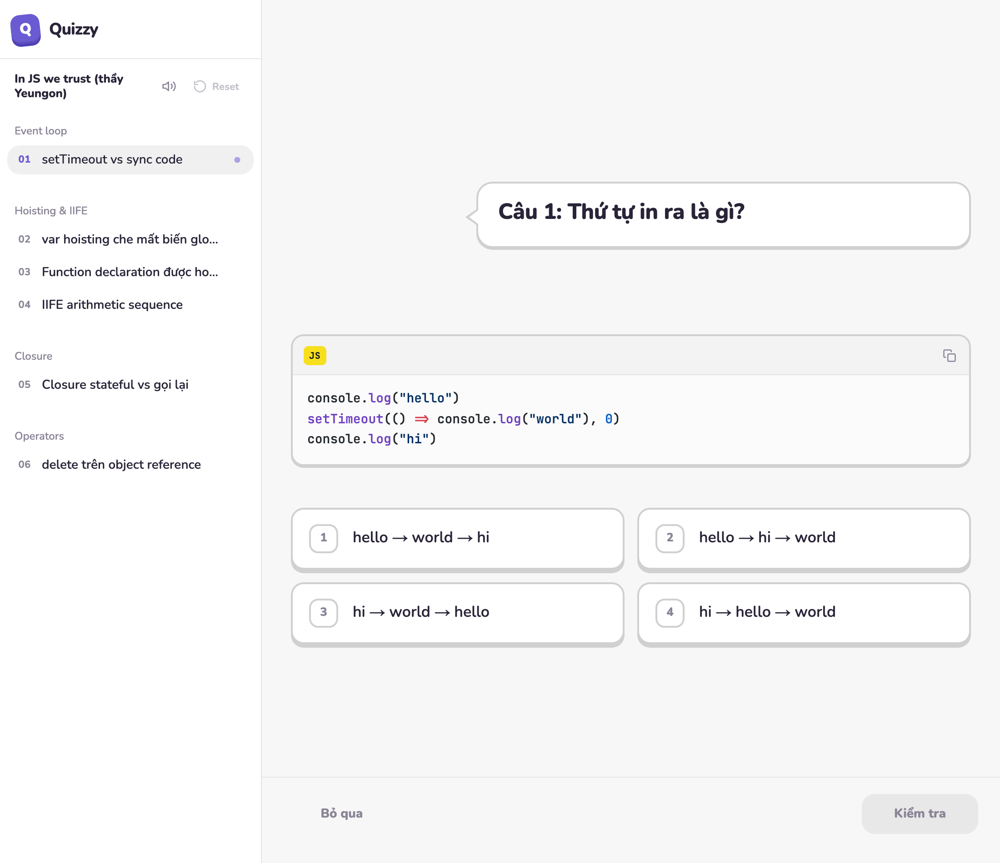

<div align="center">

# 🦉 Quizzy

**A Duolingo-style quiz app for learning programming — playful, tactile, and fast.**

[**Live demo → quiz.malburo.site**](https://quiz.malburo.site)

</div>


Quizzy turns programming fundamentals (HTML, CSS, JS, TS, React, Next.js, Express, MongoDB, Socket.io) into bite-sized multiple-choice quizzes with the chunky, satisfying feel of Duolingo. Quizzes are authored in plain Markdown; progress is saved locally — no account needed.

> ℹ️ Quiz content is in Vietnamese 🇻🇳.

## ✨ Features

- **Duolingo-style lesson flow** — 3D press buttons, choice states (select / correct / wrong), a feedback panel that slides up from the bottom, and randomized encouraging messages.
- **Interactive Rive mascot** — reacts to your answers (happy / sad), with a randomized look.
- **Sound + haptics** — satisfying, toggleable audio cues and vibration on supported devices.
- **Markdown quizzes** — questions, code, and explanations in Markdown; server-side syntax highlighting (Shiki) with Next.js-docs–style code blocks + a copy button.
- **Keyboard friendly** — press **1–4** to pick an answer.
- **Local progress** — per-question correct/wrong tracking via localStorage (Zustand persist).
- **SEO + share cards** — file-based metadata, `next/og` Open Graph images, sitemap, robots.
- **Accessible motion** — honors `prefers-reduced-motion`.



## 🧱 Tech stack

- **Next.js 16** — App Router, React Server Components, Partial Prerendering, `cacheComponents`
- **React 19** with the React Compiler
- **TypeScript** · **Tailwind CSS v4**
- **Zustand** (state + persist) · **Rive** (avatar) · **Shiki** (highlighting) · **motion** (animation)
- **Turborepo + pnpm** monorepo

## 📦 Monorepo layout

```
apps/
  quizzy/      # the quiz web app  (apps/admin — planned)
```

## 🚀 Run locally

```bash
pnpm install
pnpm dev            # quizzy → http://localhost:3001
# pnpm build · pnpm lint · pnpm type-check
```

Requires Node ≥ 20 and pnpm.

---

<div align="center">
Built with ☕ by <a href="https://malburo.site">malburo</a> · if you like it, drop a ⭐
</div>
