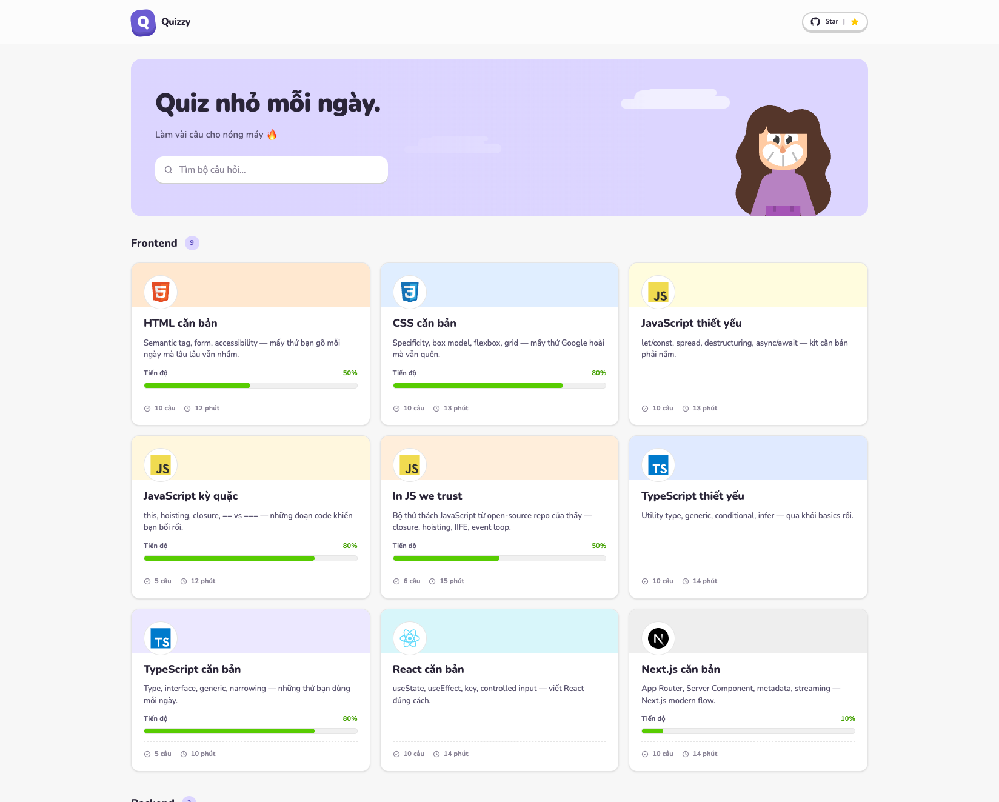
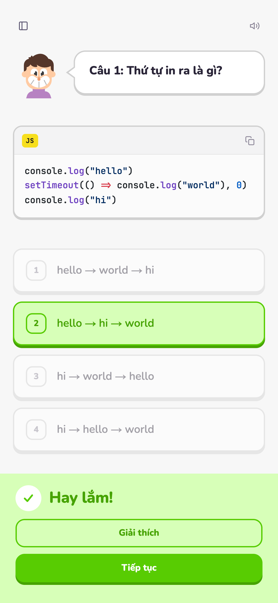
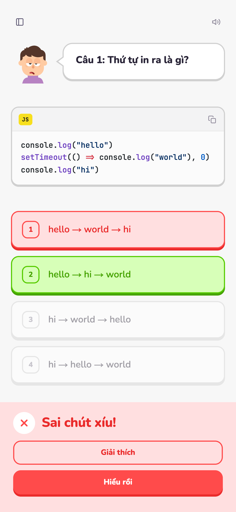

<div align="center">

# 🦉 Quizzy

**A Duolingo-style quiz app for learning programming — playful, tactile, fast.**

[](https://quiz.malburo.site)
&nbsp;
&nbsp;
&nbsp;

</div>



Bite-sized multiple-choice quizzes for web fundamentals — HTML, CSS, JS, TS, React, Next.js, Express, MongoDB, Socket.io — with the chunky, satisfying feel of Duolingo. Questions are authored in plain Markdown and progress is saved locally, so there's no sign-up.

> Quiz content is in Vietnamese 🇻🇳.

## Features

- **Duolingo-style lesson flow** — 3D buttons, distinct choice states, a feedback panel that rises from the bottom, and randomized encouragement.
- **Interactive Rive mascot** that reacts to every answer.
- **Sound + haptics** — toggleable audio cues and vibration where supported.
- **Markdown quizzes** with server-side syntax highlighting (Shiki) and Next.js-docs–style code blocks + copy button.
- **Keyboard friendly** — press `1`–`4` to answer.
- **Offline-first progress** via `localStorage` (Zustand persist).
- **SEO & share cards** with `next/og`, sitemap, and robots.
- **Accessible motion** — honors `prefers-reduced-motion`.

## Screenshots


Instant feedback, with the answer revealed and an explanation a tap away:

<table>
  <tr>
    <td align="center"><b>Correct</b></td>
    <td align="center"><b>Incorrect</b></td>
  </tr>
  <tr>
    <td width="50%"></td>
    <td width="50%"></td>
  </tr>
</table>

## Tech stack

**Next.js 16** (App Router · RSC · Partial Prerendering · React Compiler) · **React 19** · **TypeScript** · **Tailwind CSS v4** · **Zustand** · **Rive** · **Shiki** · **Turborepo + pnpm**

## Getting started

```bash
pnpm install
pnpm dev            # → http://localhost:3001
```

Requires Node ≥ 20 and pnpm. Other tasks: `pnpm build`, `pnpm lint`, `pnpm type-check`.

Turborepo monorepo — the app lives in `apps/quizzy` (an `apps/admin` is planned).

---

<div align="center">

Designed &amp; built by **[malburo](https://malburo.site)** in collaboration with **[Claude Code](https://claude.com/claude-code)**.

If Quizzy made learning a little more fun, leave a ⭐

</div>
